# GenLayer Portal Spinner

An original, production-ready loading spinner for the GenLayer Portal — one
self-contained SVG file, animated with pure CSS, no dependencies and no
JavaScript required to run.

## Live demo

**https://dancayairdrop.github.io/genlayer-spinner/**

The demo page (`index.html`) renders the exact deliverable
(`genlayer-spinner.svg`) live at 16–80px on both light and dark surfaces,
plus a full-page loading state. It is served straight from this repo via
GitHub Pages — see [Deploying](#deploying) to (re)enable it.

## Concept

GenLayer's brand language describes a **static, uncompromised core** surrounded
by **autonomous, kinetic action** — which is literally what a validator network
does: independent nodes moving around a fixed point of adjudication until they
converge.

The spinner turns that into motion:

- **A ring of diamond nodes** sweeps around a shared center. A comet-style
  opacity trail (leading node brightest, fading behind) makes the rotation read
  instantly as a spinner — even at 16px — while the diamond shape keeps the
  angular, "stripped of visual noise" geometry from GenLayer's brand mark.
- **A static core diamond** sits at the center and breathes (scale + fade),
  standing in for the fixed adjudication point everything resolves to.
- No wheel-of-dashes and no generic ring — the motif is GenLayer-specific.

## What's in this folder

| File | Purpose |
|---|---|
| `genlayer-spinner.svg` | The deliverable. Single file, inline `<style>`, infinite CSS loop. |
| `index.html` | Live demo / deployment entry: the spinner at 16–80px on light & dark, plus a full-page state and usage snippets. |
| `preview.html` | Redirects to `index.html` (kept for backwards-compatible links). |
| `README.md` | This file. |

## Using it

**As an image** (simplest, good for static loading pages):

```html

```

When loaded through `` the color is baked to the SVG's own
`color:` value (**Kinetic Cobalt `#110FFF`**), because an ``-referenced
SVG renders in an isolated context. To ship a lighter variant for dark
surfaces, save a copy with `color:#4C6FFF` on the root `<svg>`.

**Inlined** (recommended inside the Portal app — lets you theme per context):

```jsx
// paste the contents of genlayer-spinner.svg into your component
<svg viewBox="0 0 100 100" style={{ color: '#110FFF', width: 32, height: 32 }}>
  …
</svg>
```

When the SVG is inlined into the page, `color` on the root (or any ancestor)
flows into the shapes via `currentColor`, so a single component can be tinted
per context — `#110FFF` on light surfaces, `#4C6FFF` on `Carbon Void #070707`.
`index.html` demonstrates both.

## Requirements checklist

- ✅ **Original animated spinner**, web-ready (SVG + CSS `@keyframes`, no
  external libraries, fonts, or JavaScript).
- ✅ **Smooth infinite loop** — GPU-friendly (`transform`/`opacity` only).
- ✅ **Works on light and dark backgrounds** — `currentColor`-driven when
  inlined; see `index.html`.
- ✅ **Readable at small sizes** — the comet ring reads as a spinner down to
  16px (verified in the demo).
- ✅ **Deployed and verifiable** — live on GitHub Pages (link above), served
  from this repo's source with no build step.
- ✅ **GenLayer identity** — official Kinetic Cobalt (`#110FFF`), the
  diamond/angular motif from the brand mark, and a motion concept (nodes
  converging on a fixed core) drawn from GenLayer's "autonomous core"
  positioning.
- ✅ **Accessible & considerate** — `role="status"` / `aria-label="Loading"`
  for screen readers, and `prefers-reduced-motion` slows the loop instead of
  killing it.

## Deploying

The demo is a static site (no build step). To publish it on GitHub Pages:

1. Go to the repo **Settings → Pages**.
2. Under **Build and deployment → Source**, choose **Deploy from a branch**.
3. Select branch **`main`** and folder **`/ (root)`**, then **Save**.
4. Wait ~1 minute; the site goes live at
   `https://dancayairdrop.github.io/genlayer-spinner/` (GitHub Pages serves
   `index.html` at the root).

## License

Submitted for GenLayer's use in the Portal — free to use, modify, and ship.
Released under **MIT** (or CC0 if GenLayer prefers a public-domain dedication).
